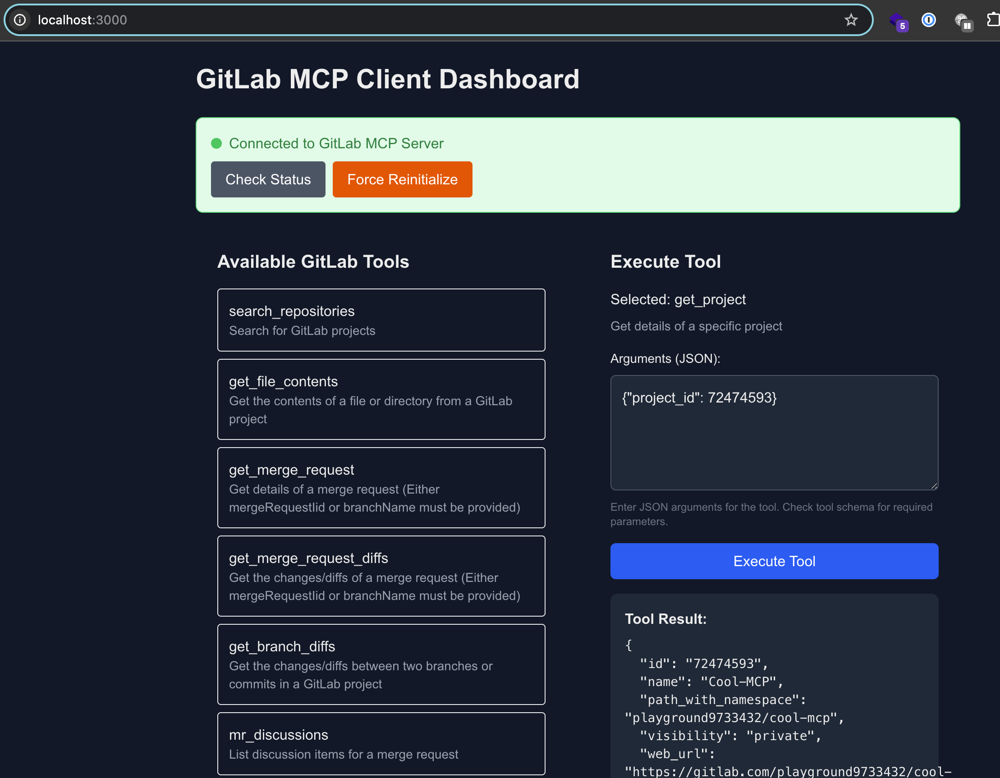
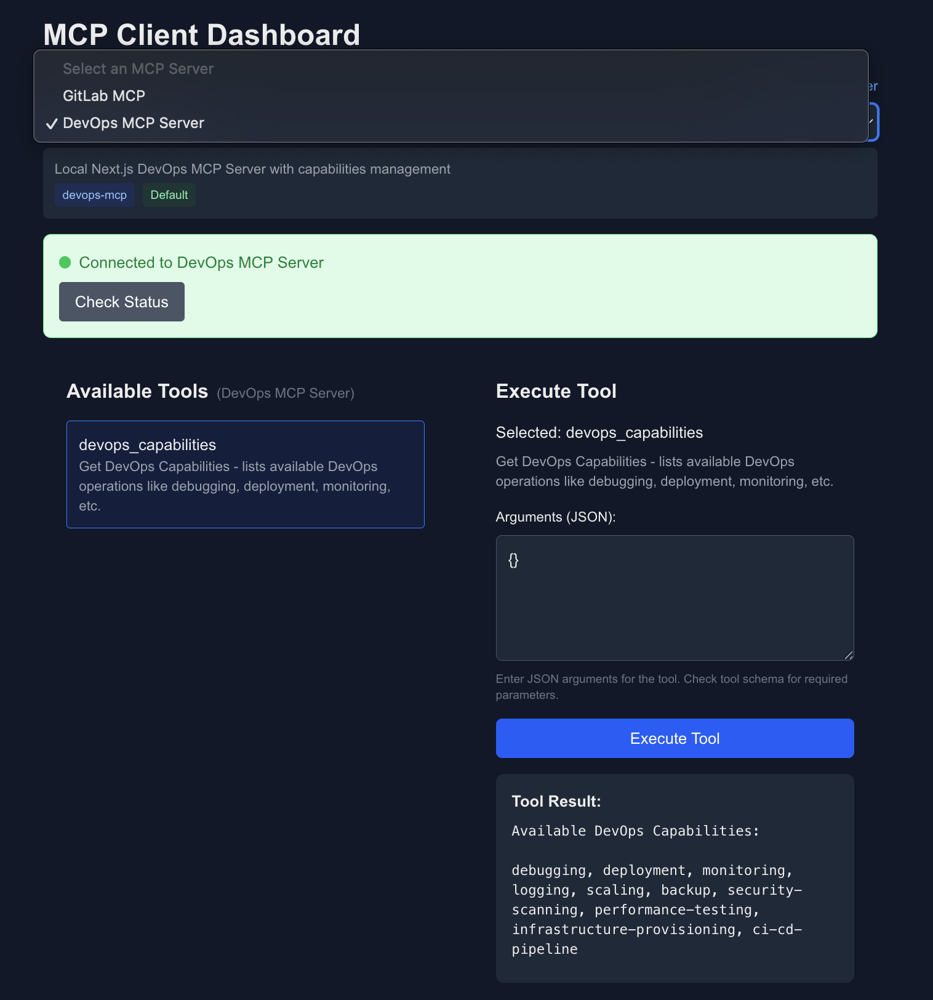

# Next.js MCP Client





## Setup 
See [SETUP.md](./SETUP.md) for installation and configuration instructions.

## How the MCP Connection Works

### 1. MCP Connection Initialization
- Creates MCP client instance using `@modelcontextprotocol/sdk`
- Establishes HTTP transport to the MCP server
- Client sends initialize request:
  ```json
  {
    "jsonrpc": "2.0",
    "id": 1,
    "method": "initialize",
    "params": {
      "protocolVersion": "2024-11-05",
      "capabilities": {
        "tools": {},
        "sampling": {}
      },
      "clientInfo": {
        "name": "nextjs-mcp-client",
        "version": "1.0.0"
      }
    }
  }
  ```
- Server responds with capabilities:
  ```json
  {
    "jsonrpc": "2.0",
    "id": 1,
    "result": {
      "protocolVersion": "2024-11-05",
      "capabilities": {
        "tools": {
          "listChanged": true
        }
      },
      "serverInfo": {
        "name": "gitlab-mcp-server",
        "version": "1.0.0"
      }
    }
  }
  ```
- Client sends initialized notification:
  ```json
  {
    "jsonrpc": "2.0",
    "method": "notifications/initialized"
  }
  ```

### Session ID Management
- Each MCP connection establishes a unique session ID
- Session ID is used to:
  - Track request/response pairs in JSON-RPC communication
  - Maintain state between client and server
- Session remains active until client disconnects or server terminates

### 2. Tool Discovery
- Requests available tools:
  ```json
  {
    "jsonrpc": "2.0",
    "id": 2,
    "method": "tools/list"
  }
  ```
- Displays tools in the dashboard
- Enables tool execution with JSON parameters
